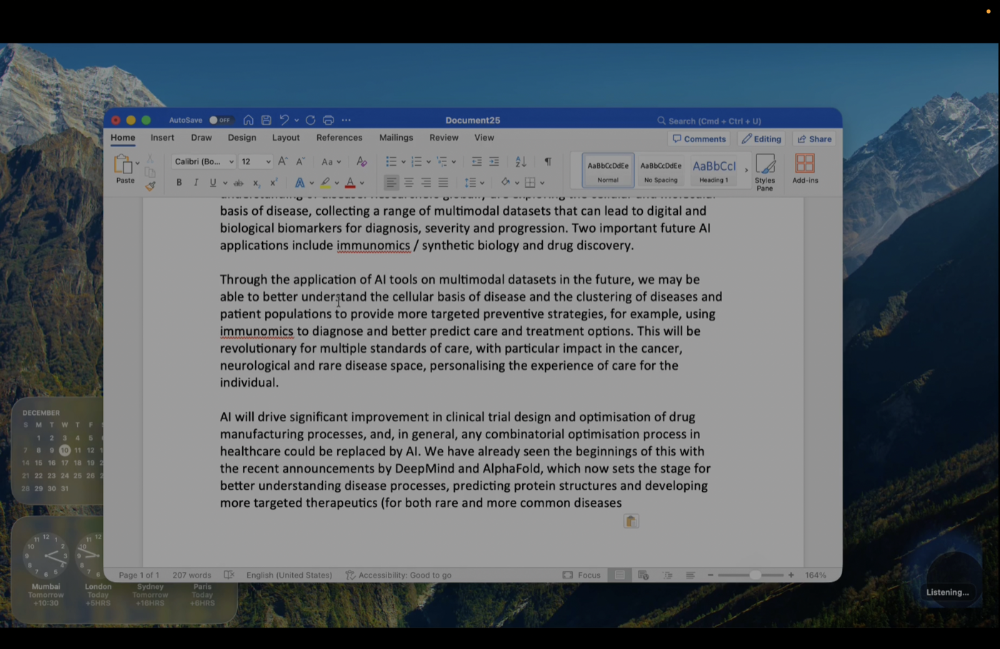
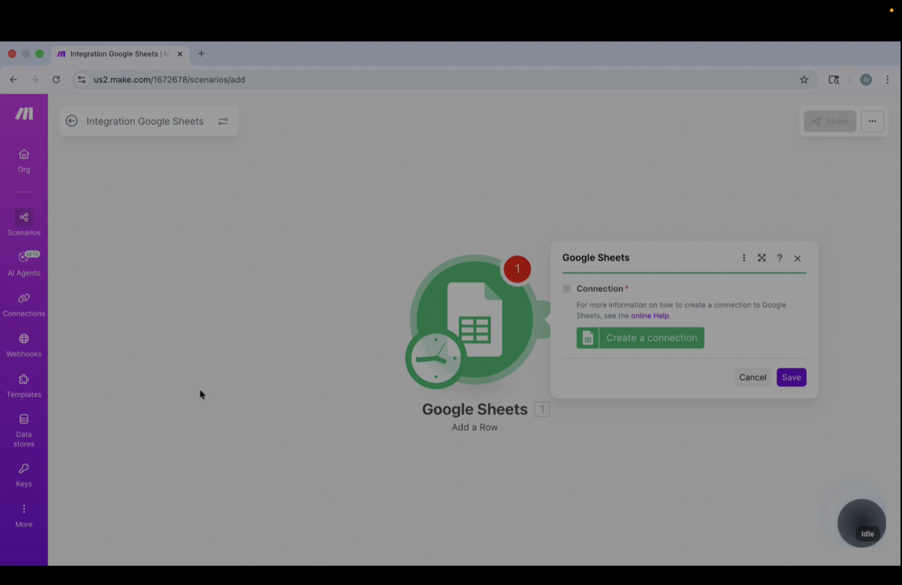
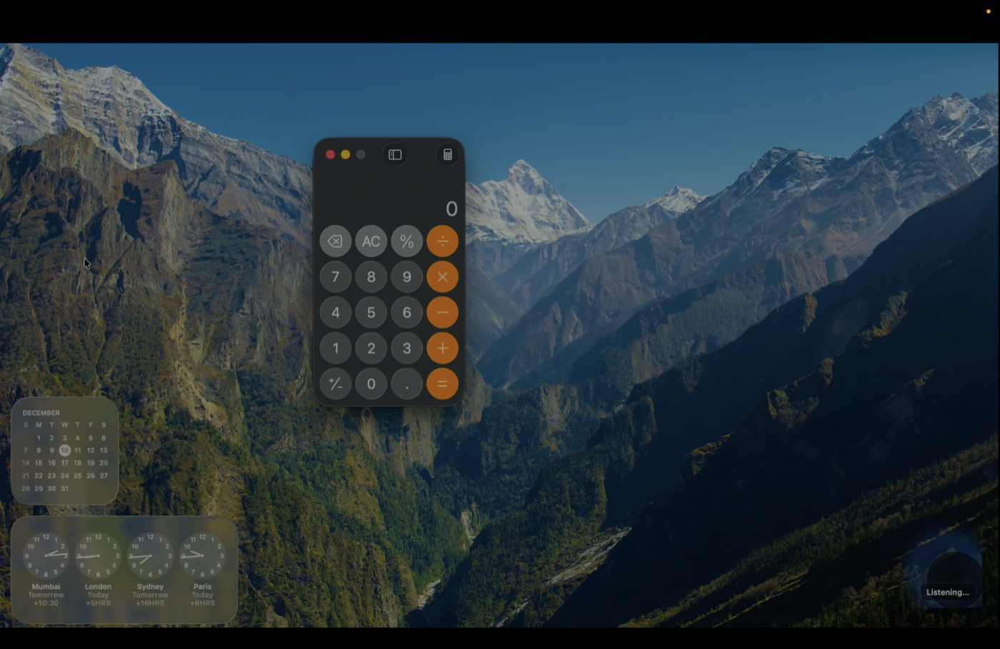

# Jarvis

**Jarvis is a local desktop assistant prototype designed to understand context, remember preferences, and perform actions on the user's Mac with explicit permission.**

Jarvis is a local-first AI desktop assistant for macOS, inspired by the idea of a personalized operating-system-level assistant. It supports conversation, daily task tracking, screen-aware summarization, writing assistance, app launching, and best-effort workflow automation through user-granted local permissions.

Because Jarvis depends on local Mac permissions, screen context, microphone input, and desktop automation, it is not deployed on Vercel, Render, AWS, or any public cloud host. The best way to evaluate it is through the local demo video and the source code in this repository.

## Demo

Demo video:

[](https://youtu.be/uISCi_UVRec)

The demo shows Jarvis running locally on macOS. It walks through the assistant-style flow: voice interaction, document/screen context, summarization, rewriting, and task-style responses. The video is the main proof because the project is local and permission-driven.

### Screenshots

| Voice dictation in Word | Browser/app interaction |
| --- | --- |
|  |  |

| Opening local apps | HUD speaking state |
| --- | --- |
|  |  |

## Why I Built It

The initial inspiration was the idea of a Jarvis-like assistant from Iron Man, but I wanted to approach it as a serious human-computer interaction and AI agent project rather than a fantasy interface.

I wanted to explore what a more personal, context-aware, and action-oriented assistant could look like beyond traditional voice assistants. Most assistants can answer questions or trigger a few predefined commands, but they often feel disconnected from the work happening on the actual computer. My goal was to build something that could listen, remember, read visible context, help with writing, and take useful local actions.

The most important learning for me was that a useful assistant cannot be only an LLM. It needs a system around it: deterministic tools for actions, memory for continuity, OCR for screen context, safety boundaries for permissions, and a user experience that knows when to stay quiet.

The project vision is documented in [docs/VISION.md](docs/VISION.md). The build process and personal engineering notes are in [docs/BUILD_NOTES.md](docs/BUILD_NOTES.md).

## Core Capabilities

- **Conversational AI assistant:** answers questions, discusses topics, explains ideas, and keeps short-term conversational context.
- **Daily agenda:** add, read, update, delete, move, and mark agenda items in local SQLite storage.
- **Memory and preference recall:** stores local messages, preferences, action logs, agenda items, and embedding-based recall hooks.
- **RAG-based contextual recall:** indexes messages and notes with embeddings for lightweight retrieval when relevant.
- **App launching and closing:** opens local macOS applications and supports close/sign-off style commands.
- **Screen/text summarization:** reads visible screen text through OCR and summarizes it through the LLM.
- **Writing assistance:** rewrites, polishes, formalizes, and improves selected or screen-visible text.
- **Dictation mode:** types spoken text into apps such as Notes or Word, with basic punctuation handling.
- **Weather, time, news, jokes, and facts:** supports practical assistant queries through local tools and APIs.
- **Mac workflow automation:** best-effort click, scroll, type, copy, cut, paste, select, and tab/application actions.
- **Accessibility-enabled interaction:** performs local actions only inside the boundaries of implemented tools and user-granted macOS permissions.
- **HUD interface:** uses a small SwiftUI/AppKit overlay to show idle, listening, and speaking states.

More detail is in [docs/CAPABILITIES.md](docs/CAPABILITIES.md). Memory and retrieval are covered in [docs/MEMORY_RAG.md](docs/MEMORY_RAG.md).

## Tech Stack

- **macOS app:** Swift, SwiftUI, AppKit, AVFoundation
- **Local backend:** Node.js, TypeScript, Express
- **Package/runtime tooling:** npm, Swift Package Manager
- **Database/local state:** SQLite with `better-sqlite3`
- **AI APIs:** OpenAI chat completions, embeddings, speech-to-text, and text-to-speech
- **OCR/screen context:** macOS screenshot capture and Apple Vision OCR
- **Automation:** AppleScript, macOS System Events, shell commands, Chrome remote debugging helpers
- **Testing/CI:** TypeScript build, headless backend smoke test, GitHub Actions for Node-only checks

## Architecture

At a high level, Jarvis follows this loop:

```text
Voice/text/screen input
  -> Swift macOS app and HUD
  -> local TypeScript backend
  -> command router, memory, OCR, and LLM reasoning
  -> local tools/actions or generated answer
  -> SQLite logging/state
  -> text response, TTS audio, clipboard output, or desktop action
```

The LLM helps with interpretation, writing, summarization, and conversation. It does not directly control the machine. Local tools execute actions through explicit code paths.

Read the technical breakdown in [docs/ARCHITECTURE.md](docs/ARCHITECTURE.md). Workflow examples are documented in [docs/AUTOMATION_WORKFLOWS.md](docs/AUTOMATION_WORKFLOWS.md), and major tradeoffs are explained in [docs/ENGINEERING_DECISIONS.md](docs/ENGINEERING_DECISIONS.md).

## Local-First Design

Jarvis is local-first by design. It needs to run on the user's Mac because its core features depend on:

- microphone input
- local app/window state
- screen context
- user-granted macOS Accessibility permissions
- user-granted Screen Recording permissions
- local SQLite memory and preferences
- desktop automation through AppleScript/System Events

That is why the portfolio format is GitHub plus demo video, not a public web deployment. A hosted web app would not be able to honestly show the main thing Jarvis proves: connecting AI reasoning to real local desktop workflows.

## Local Setup

Prerequisites:

- macOS
- Node.js and npm
- Xcode Command Line Tools / Swift toolchain
- OpenAI API key
- macOS permissions listed in [docs/PERMISSIONS.md](docs/PERMISSIONS.md)

Install and build the backend:

```bash
npm install
npm run build
```

Create a local `.env` file from `.env.example`:

```bash
cp .env.example .env
```

Start the backend:

```bash
npm start
```

Run the macOS app from another terminal:

```bash
cd macos/JarvisApp
swift run
```

If the app logs a connection error for `http://127.0.0.1:3001`, the backend is not running or the port does not match.

## Environment Variables

```env
OPENAI_API_KEY=your_openai_api_key_here
NEWS_API_KEY=your_news_api_key_here
OPENWEATHER_API_KEY=your_openweather_api_key_here
WEATHER_DEFAULT_CITY=New York City
PORT=3001
JARVIS_BASE_DIR=/path/to/local/jarvis-data
TTS_VOICE=onyx
TTS_DISABLED=0
TTS_STUB=0
```

- `OPENAI_API_KEY`: required for LLM, embeddings, STT, and TTS
- `NEWS_API_KEY`: optional, used for headline/news workflows
- `OPENWEATHER_API_KEY`: optional, used when available for weather
- `WEATHER_DEFAULT_CITY`: default city for weather requests
- `PORT`: local backend port, defaults to `3001`
- `JARVIS_BASE_DIR`: local runtime data directory
- `TTS_VOICE`: OpenAI TTS voice; development default is `onyx`
- `TTS_DISABLED`: disables spoken output when enabled
- `TTS_STUB`: returns stubbed TTS output for tests/dev checks

## Example Commands

- "Open Microsoft Word."
- "Click on Blank Document."
- "Start dictation."
- "Read my agenda list."
- "Add going to the gym to my agenda."
- "Summarize what is on my screen."
- "Make the selected text more formal."
- "Copy your last response to the clipboard."
- "What is the weather?"
- "Tell me a joke."
- "What do you think about cricket versus baseball?"
- "Sign off."

## Testing and CI

Jarvis includes lightweight test coverage for the backend path that can run headlessly:

```bash
npm test
```

This runs TypeScript compilation and a backend smoke test. It intentionally does not test microphone capture, OCR, Accessibility permissions, AppleScript UI automation, or real app/window state because those require an actual macOS desktop session.

More detail:

- [docs/TESTING.md](docs/TESTING.md)
- [docs/CI_CD.md](docs/CI_CD.md)
- [docs/TROUBLESHOOTING.md](docs/TROUBLESHOOTING.md)

## Security and Privacy

Jarvis touches sensitive local capabilities, so the permission boundary is part of the design. It only accesses microphone, screen, Accessibility, and app automation capabilities when the user grants the required macOS permissions.

Local runtime data, API keys, logs, recordings, screenshots, generated media, and SQLite databases are ignored by git and should not be committed.

More detail:

- [SECURITY.md](SECURITY.md)
- [docs/PERMISSIONS.md](docs/PERMISSIONS.md)

## Current Limitations

The short version:

- Local-only prototype, not a public hosted product
- macOS-specific
- Requires explicit user-granted permissions
- Not packaged as a public production app yet
- Not production security or privacy software
- Desktop/browser automation is best-effort and not guaranteed across every app or website
- Automated testing is intentionally limited for OS-level behavior
- Multistep workflows exist, but they are not yet a fully reliable planner/executor loop

The fuller version is in [docs/LIMITATIONS.md](docs/LIMITATIONS.md).

## Roadmap

The long-term goal is to move Jarvis toward a safer, more capable desktop agent: better planning, better observation, better confirmations, stronger memory controls, and more reliable app/browser interaction.

See [docs/ROADMAP.md](docs/ROADMAP.md).

## Documentation Map

- [docs/VISION.md](docs/VISION.md): why Jarvis exists
- [docs/BUILD_NOTES.md](docs/BUILD_NOTES.md): how I approached the build
- [docs/ENGINEERING_DECISIONS.md](docs/ENGINEERING_DECISIONS.md): major tradeoffs and decisions
- [docs/DEMO_WALKTHROUGH.md](docs/DEMO_WALKTHROUGH.md): how to evaluate the demo video
- [docs/CAPABILITIES.md](docs/CAPABILITIES.md): what Jarvis can do
- [docs/ARCHITECTURE.md](docs/ARCHITECTURE.md): system design and data flow
- [docs/MEMORY_RAG.md](docs/MEMORY_RAG.md): memory and retrieval design
- [docs/AUTOMATION_WORKFLOWS.md](docs/AUTOMATION_WORKFLOWS.md): local workflow examples
- [docs/PERMISSIONS.md](docs/PERMISSIONS.md): required macOS permissions
- [docs/TESTING.md](docs/TESTING.md): testing strategy
- [docs/CI_CD.md](docs/CI_CD.md): CI boundaries
- [docs/TROUBLESHOOTING.md](docs/TROUBLESHOOTING.md): local setup/debugging help
- [docs/LIMITATIONS.md](docs/LIMITATIONS.md): prototype boundaries
- [docs/ROADMAP.md](docs/ROADMAP.md): future direction
