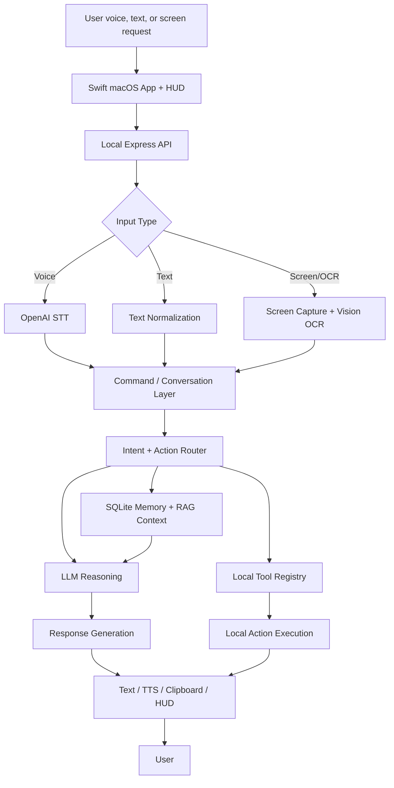

# Architecture

Jarvis is a local-first macOS assistant built as a Swift desktop app plus a TypeScript backend. The important architectural decision is that Jarvis is not just a wrapper around an LLM. It combines a conversation layer, deterministic tools, local memory, OCR, and macOS automation into one assistant loop.

## High-Level Architecture



Text version:

```text
User input
  -> Jarvis command/conversation layer
  -> intent/action router
  -> tools, memory, screen context, or LLM reasoning
  -> response generation or local action execution
  -> HUD, TTS, text output, clipboard, or desktop action
```

## Main Components

### Input Layer

The input layer lives mostly in the Swift macOS app. It handles:

- typed text commands
- voice recording
- global hotkeys
- idle/listening/speaking HUD state
- sending audio or text to the backend

Voice input is recorded locally, then sent to the local backend endpoint for transcription. Once audio becomes text, it follows the same command pipeline as typed input.

### Conversation Layer

The conversation layer decides whether the user is asking for:

- a normal answer
- a local action
- a writing or summarization task
- an agenda operation
- a screen-aware workflow
- a best-effort automation command

This layer is intentionally hybrid. Some requests are routed by deterministic patterns because they should behave predictably. Other requests use the LLM because they require language understanding or flexible reasoning.

### Intent Router

The TypeScript pipeline is the main router. It uses:

- fuzzy command matching
- explicit command patterns
- session context
- local preferences
- LLM planning where useful
- fallback behavior for ambiguous requests

Examples of deterministic routing include opening an app, reading the agenda, copying to clipboard, fetching time, and sending common keystrokes. Examples of LLM-driven work include screen summarization, rewriting selected text, and discussion-style responses.

### Memory and RAG Layer

Jarvis stores local state in SQLite through `better-sqlite3`.

The database includes:

- messages
- action logs
- preferences
- agenda items
- message embeddings
- note embeddings

The RAG layer indexes messages and notes using embeddings. It is lightweight, but it gives Jarvis a foundation for contextual recall instead of treating every request as a completely fresh conversation.

### Task Manager

Agenda management is implemented as local SQLite-backed task tracking. Jarvis can add, list, update, delete, move, and mark agenda items. This was one of the first workflows that made the project feel like an assistant instead of a chat interface because it required consistent state over time.

### Screen and Context Reader

Screen-aware workflows use macOS screen capture and Apple Vision OCR. Jarvis can extract visible text and send it to the LLM for summarization, rewriting, or explanation.

This flow depends on Screen Recording permission and visible screen content. It works best when the relevant text is readable and not hidden behind complex UI elements.

### App Automation and Action Layer

Local actions live under `src/tools/`. They include:

- opening and closing apps
- opening URLs
- clicking UI text
- OCR-based click fallback
- scrolling
- typing
- copy, cut, paste, select, and new line
- reading screen text
- fetching weather/news/time
- creating notes
- controlling simple app workflows

Jarvis uses AppleScript, System Events, shell commands, accessibility APIs, OCR, and browser helpers. This gives it practical desktop reach, but also makes it inherently more fragile than pure web code.

### Response Generation Layer

Jarvis can respond through:

- visible text in the app
- spoken audio using OpenAI TTS
- clipboard output
- direct desktop action
- HUD state changes
- terminal/debug logs

The intended interaction style is quiet and useful. Successful actions should not require long narration. Errors should be understandable for the user while detailed logs stay in the terminal.

### Logging and Error Handling

Jarvis logs messages and action results locally. Failure handling exists for:

- missing or invalid input
- missing permissions
- app not found
- screen text unavailable
- OCR miss
- LLM/API failure
- ambiguous commands
- unsupported operating systems

For public/recruiter evaluation, this matters because assistant systems fail often. The important part is not pretending failure cannot happen, but designing a path to observe it and recover.

### Test and CI Layer

The CI layer is intentionally small. It runs TypeScript compilation and a backend smoke test. It does not attempt to test macOS microphone, OCR, Accessibility, or UI automation because those require a real user session and explicit local permissions.

## Data Flow: Conversation

1. User sends a voice or text command.
2. If voice, Jarvis transcribes it through STT.
3. Jarvis normalizes the request.
4. Jarvis checks deterministic routes and recent context.
5. If needed, Jarvis retrieves relevant memory/RAG context.
6. Jarvis generates a response or action plan.
7. Jarvis returns the answer through text, TTS, or HUD state.

## Data Flow: Screen Summarization

1. User asks Jarvis to summarize visible content.
2. Jarvis uses user-granted Screen Recording permission.
3. A screenshot is captured locally.
4. Apple Vision OCR extracts visible text.
5. The extracted text is sent through the summarization prompt.
6. Jarvis returns a concise summary to the user.

## Data Flow: Desktop Automation

1. User gives a command such as "open Word" or "click Blank Document."
2. Jarvis identifies the target app/action.
3. Jarvis executes the action through local tools.
4. The result is logged locally.
5. Jarvis either stays quiet on success or reports a short failure message.

## Local-First Design

Jarvis runs locally because the core product idea depends on local context:

- which app is open
- what text is visible on screen
- what the user is saying into the microphone
- what local actions macOS allows
- what preferences and agenda items are stored locally

A cloud deployment would remove the most interesting part of the project: AI connected to real desktop workflows.

## Failure Handling

Jarvis handles common failure cases defensively:

- **Missing permissions:** Screen/OCR or Accessibility actions may fail until the user grants permission.
- **App not found:** app launch tools return a structured failure instead of silently breaking.
- **Screen context unavailable:** summarization can fail if OCR cannot read useful text.
- **LLM/API failure:** deterministic tools should still work when possible; language-heavy features need API availability.
- **Ambiguous commands:** the router attempts fuzzy matching, then falls back to LLM interpretation or a short failure response.

## Future Architecture

The current architecture proves the assistant loop. The next version should harden it:

- stronger planner/executor loop
- richer tool registry with schemas and permissions
- explicit confirmation layer for risky actions
- better observation after each action
- local model support for privacy-sensitive workflows
- memory management UI
- encrypted memory store
- better telemetry for debugging without exposing user data
